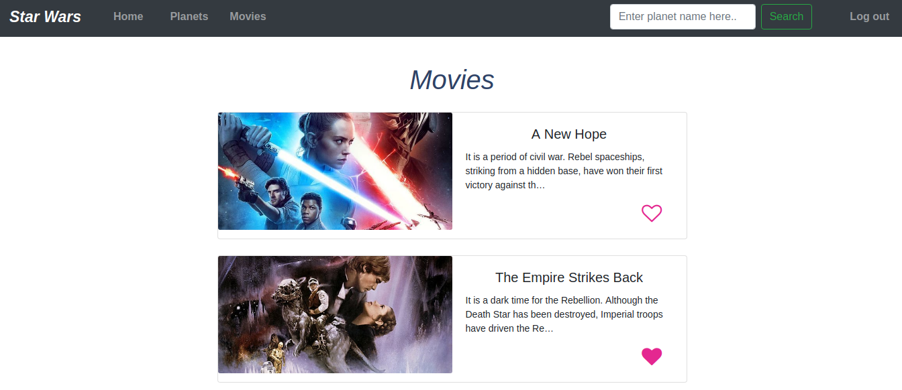

# Star Wars App

###### A star wars app, built with Django.
    Lets you view & favourite your desired star wars data.

## Features Implemented

- Loads list of planets & movies from SWAPI 
- View planets & movies
- Favourite & unfavourite planets & movies
- View favourited planets & movies on the home page
- Navigate through various views within the app with navbar
- Search planet name to see the detailed view of the planet


## Screenshots

###### Planets' List (can favourite/unfavourite a planet)


###### Movies' List (can favourite/unfavourite a movie)



## For Developers

### Installation Instructions

- Run following commands after cloning this repository

```
# Go inside the directory containing the project
cd star-wars

# Create virtual environment
virtualenv -p python3.7 venv

# Activate the virtual environment
source venv/bin/activate

# Install libraries needed from requirements.txt
pip install -r requirements.txt

# Go inside the 'star_wars' directory & run migrations
cd star_wars
python manage.py makemigrations
python manage.py migrate

```

#### Run the App
- To run the app, run following command and open `localhost:8000` in the browser once the development server has started.

```
python manage.py runserver
```

