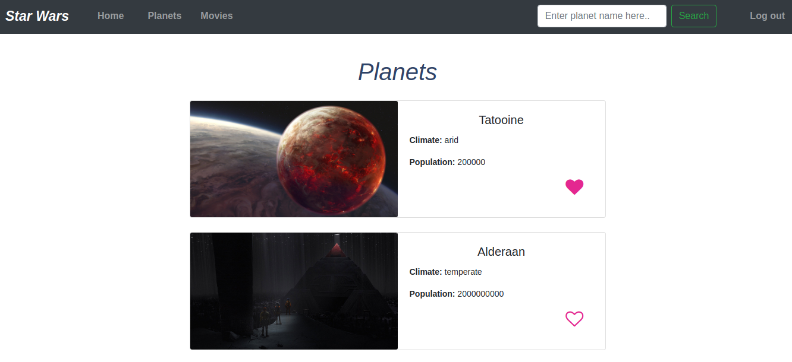

# Star Wars App

###### A star wars app, built with Django.
    Lets you view & favourite your desired star wars data.

## Features

- Loads list of planets & movies from SWAPI 
- View planets & movies
- Favourite & unfavourite planets & movies
- View favourited planets & movies on the home page
- Navigate through various views within the app with navbar
- Search planet name to see the detailed view of the planet
- Pagination support for planets through URL as well as through UI navigation

## Screenshots

###### Login on homepage


###### List of Movies (can favourite & unfavourite movies)


###### List of Planets (can favourite & unfavourite planets)



## For Developers

### Installation Instructions

Run following commands inside the cloned repository:

```
# Create virtual environment
virtualenv -p python3.7 venv

# Activate the virtual environment
source venv/bin/activate

# Install libraries needed from requirements.txt
pip install -r requirements.txt

# Go inside the 'star_wars' directory & run migrations
cd star_wars && python manage.py migrate

# To start the development server
python manage.py runserver
```

### Tech Stack
- Python/Django
    - Framework used to create the app
- Bootstrap 4
    - To make the app responsive
- FontAwesome
    - For icons
- Star Wars API (SWAPI)
    - To fetch data for planets & movies

### Tech Stack
- Python/Django
    - Framework used to create the app
- Bootstrap 4
    - To make the app responsive
- FontAwesome
    - For icons
- Star Wars API (SWAPI)
    - To fetch star wars data for planets & movies

## Technical Details

### App Endpoints - `/app`

- `/login`:
    - Login page
- `/home`:
    - Home page, showing list of favourited planets & movies
- `/planets`:
    - List of planets with pagination & favourite/unfavourite button
    - Pagination:
        - `/app/planets/1` - for page 1
        - `/app/planets/2` - for page 2
        - Navigation also available through UI
- `/movies`:
    - List of movies with favourite/unfavourite button
- `/search`:
    - Detailed planet view by its name available through the UI
